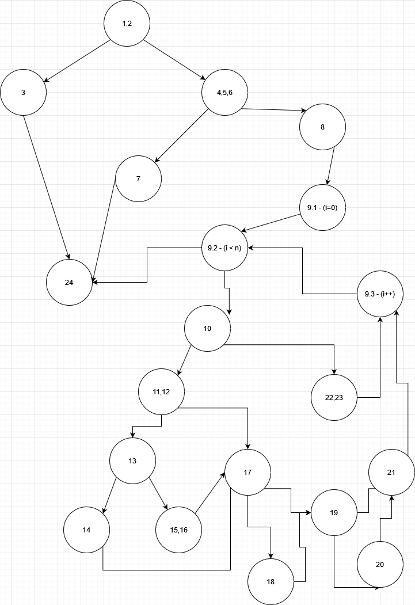
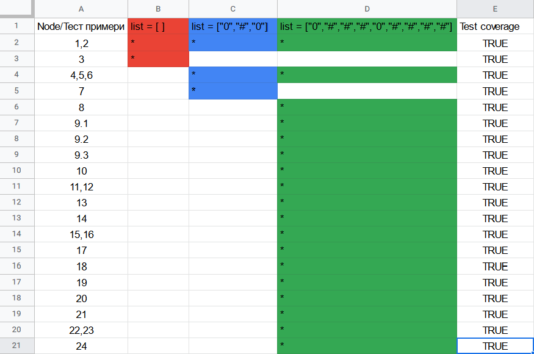
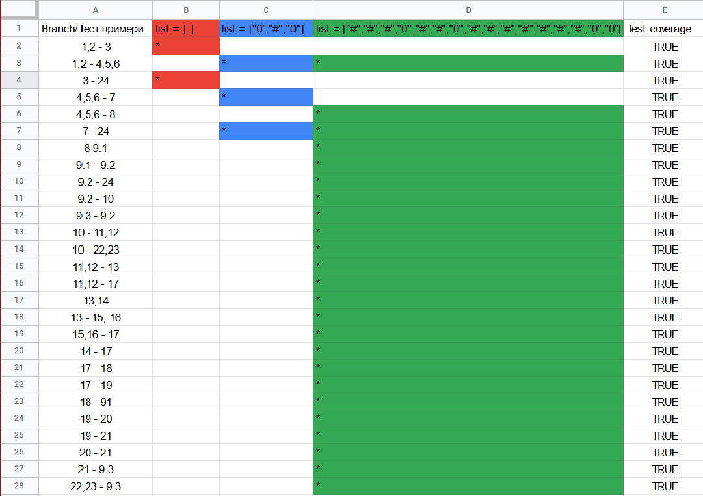

Милан Трпчевски 206063 

<h2>2. Слика од Control Flow Graph:</h2> 
 

<h2>3. Цикломатска комплекснос</h2><h5> Цикломатската комплекснос ја добив по формулата Cyclomatic complexity = R (Regions), од каде заклучив дека цикломатската комплекснос е 9.</h5>

<h2>4. Every Statement критериум</h2> 
 
<h5>За да ги исполнам сите критериуми ми беа потребни 3 тест случаи. 
 - Првиот тест случај е празна листа која фрла исклучок  "throw new IllegalArgumentException("List length should be greater than 0")". 
 - Вториот тест случај фрла исклучок "throw new IllegalArgumentException("List length should be a perfect square")". 
 - Третиот тест случај не фрла исклучок и ги покрива сите други јазли и ја завршува програмата со "return numMines;"</h5>

<h2>5. Every Branch критериум</h2> 
 
<h5>Исто како и кај Every Statment критериумот потребни ми беа 3 тест случаи. 
- Првиот тест случај исто ќе фрли исклучок "throw new IllegalArgumentException("List length should be greater than 0")". 
- Вториот тест случај ќе влезе во чекор 7 и ќе фрли исклучок "throw new IllegalArgumentException("List length should be a perfect square")". 
- И со третиот тест случај ги поминуваме сите останати чекори и ја завршуваме програмата со "return numMines;"</h5>

